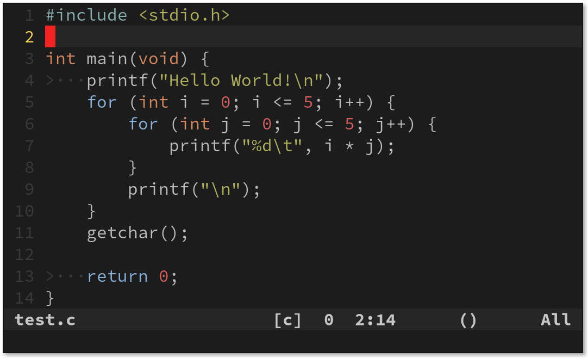
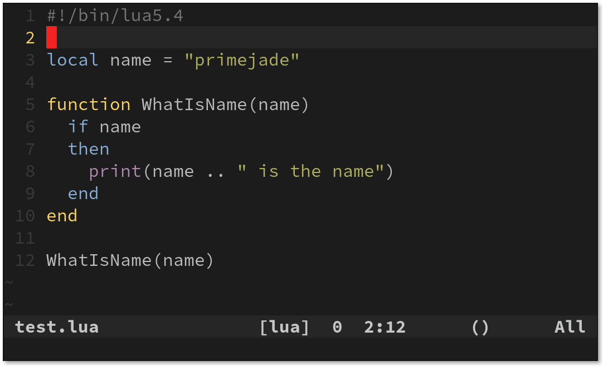
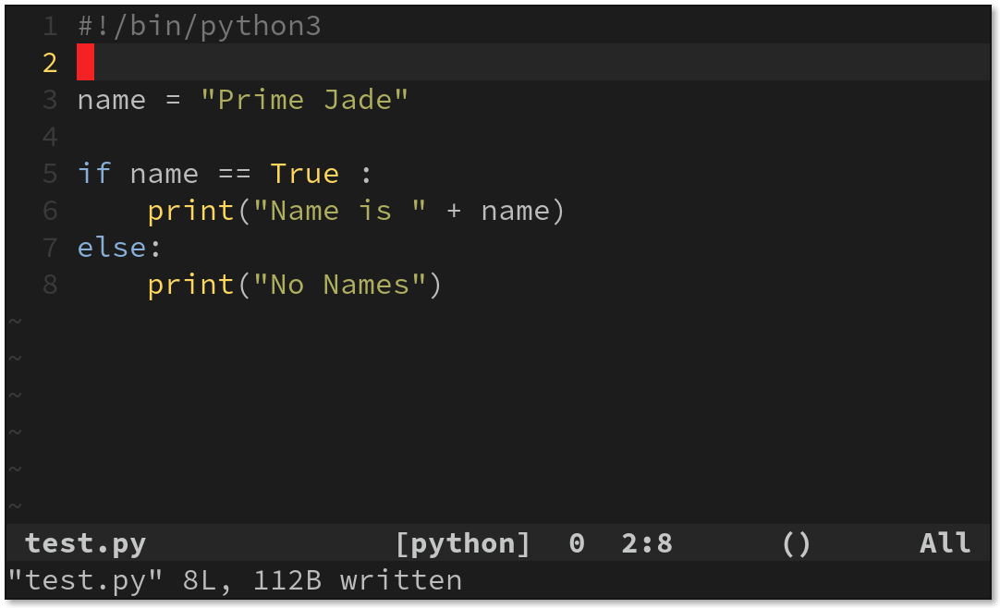

# vim
my vim configuration

Vim will have separate colorschemes and configurations
in GUI, Terminal and tty

- Terminal
    - colorscheme: hybrid (dark)
- tty
    - colorscheme: industry
- GUI (gvim/vim-gtk3)
    - font: Liberation Mono
    - colorscheme: hybrid_material (light)

### Screenshots

**c**

**lua**

**python**

