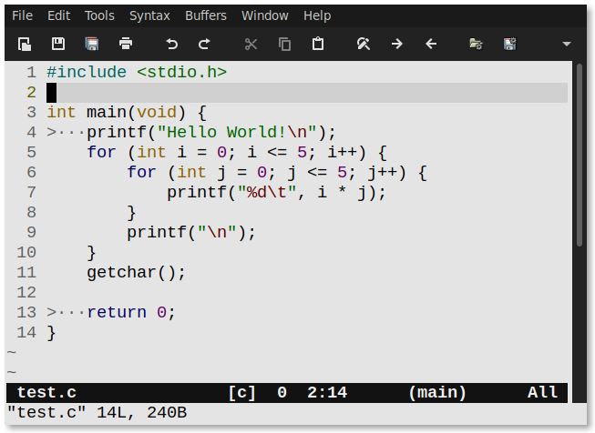

# vim
my vim configuration

Vim will have separate colorschemes and configurations
in GUI, Terminal and tty

- Terminal
    - colorscheme: hybrid (dark)
- tty
    - colorscheme: industry
- GUI (gvim/vim-gtk3)
    - font: Liberation Mono
    - colorscheme: hybrid_material (light)

I'm used to have `\` as leader key.
You can set `mapleader` to something else, like `,`

If you change the leader key to`,`
keep that in mind I have `,` key set to get some skel files located in 
`$HOME/.vim/templates`. take a look at `skels.vim` file.

```vim
let mapleader=','
```

The variable defined in `keybinds.vim` file:

### Screenshots

**c**


**c (gvim)**




**lua**


